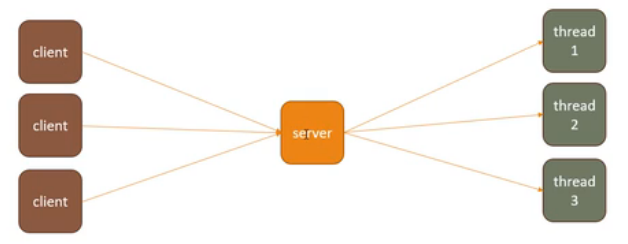
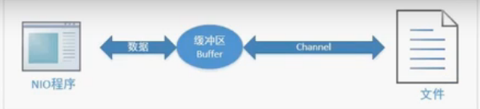
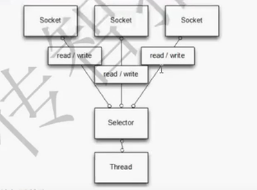
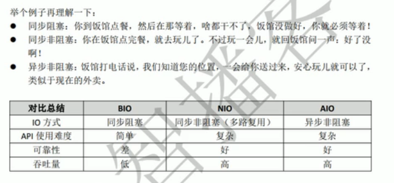
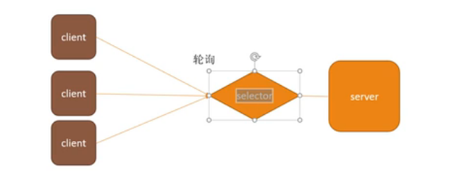
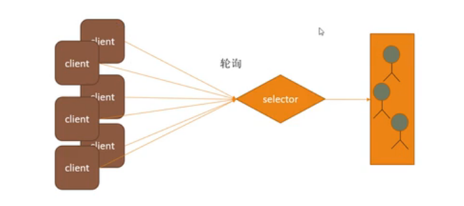
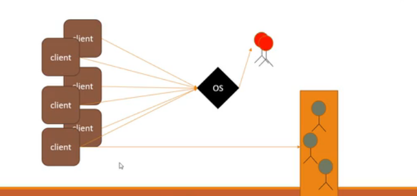
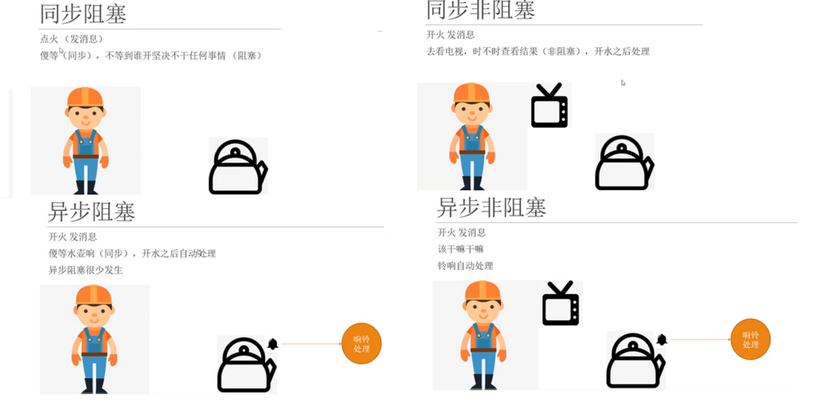
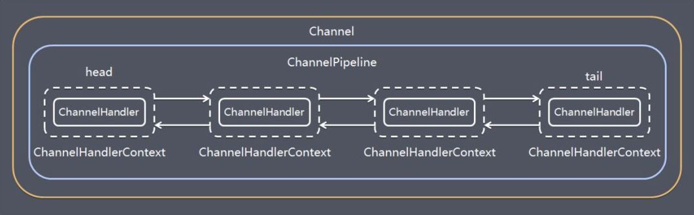
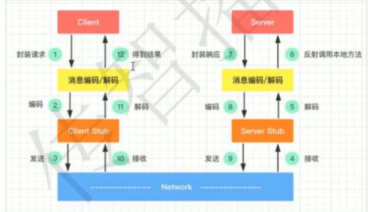

# IO

## BIO

> bio：阻塞io,如下实例在连接客户端和读写时均要阻塞。
>
> * 以流的形式进行数据读写
>
> * 需要自己创建数据缓冲数组如：byte[]
>
> * 阻塞式（accept/read/write/connect）
>
> * 每个线程一个客户端，因为不能一直等前一个客户端处理完了才去处理下一个连接
>
> * 通道单向的
>
> * 不适合大量客户端连接，由于存在大量阻塞
>
>   

```java
//服务端      		
			ServerSocket serverSocket = new ServerSocket(9999);
            while (true) {
                Socket accept = serverSocket.accept();//阻塞等待客户端连接
                InputStream inputStream = accept.getInputStream();
                byte[] buff = new byte[1024];
                inputStream.read(buff);//阻塞等待消息
                System.out.println(new String(buff));
                OutputStream outputStream = accept.getOutputStream();
                outputStream.write("没有".getBytes());//阻塞
                outputStream.flush();
                outputStream.close();
            }
```

## NIO

> nio:new io或者为non-blocking IO jdk1.4之后提供的新API,非阻塞IO，但也支持阻塞式。
>
> * 以通道channel进行数据读写
> * 提供一个buffer
> * 非阻塞式


### NIO进行文件操作基本流程

> nio进行文件操作的示意图



### NIO中的buffer

> buffer用于读写的缓冲区，数据  ==必须写入到buffer==中才能将数据写入文件或读入到内存中。

```java
//创建一个大小为1024的buffer初始位置为0【指针为0】	 			
ByteBuffer buffer = ByteBuffer.allocate(1024);
//写入数据到缓冲区
buffer.put("space".getBytes());
//反转缓冲区,将类似一个游标的东西重置到初始位置。
buffer.flip();
```


### NIO中的channel

> 与流的区别：流是单向的，IntputStream就只能读。但channel是双向的,读写都可以。

通道是建立在==流==的基础之上的,将buffer写入通道中，由通道完成读写操作

```java
FileOutputStream out = new FileOutputStream("test.text");
//获得channel通道
FileChannel channel = out.getChannel();
```


### NIO进行文件操作

* 写入数据到文件中

  ```java
  public static void writeData(){
          FileOutputStream out = null;
          try {
              //1.创建读操作的流为创建channel做准备
              out = new FileOutputStream("test.text");
              //2.获得channel通道
              FileChannel channel = out.getChannel();
              //3.必须提供一个缓冲区
              ByteBuffer buffer = ByteBuffer.allocate(1024);
              //4.写入数据到缓冲区
              buffer.put("space".getBytes());
              //5.反转缓冲区,将类似一个游标的东西重置到初始位置。
              buffer.flip();
              //6.把缓冲区写入到通道channel中,通道负责写入数据到文件
              channel.write(buffer);
          } catch (Exception e) {
              e.printStackTrace();
          }finally {
              try {
                  out.close();//关闭流
              } catch (IOException e) {
                  e.printStackTrace();
              }
          }
  
      }
  ```

* 读取数据

  ```java
  public static void readData(){
          FileInputStream in = null;
          try {
              File file = new File("test.text");
              in = new FileInputStream(file);
              FileChannel channel = in.getChannel();
              //精确设置buffer大小
              ByteBuffer buffer = ByteBuffer.allocate((int) file.length());
              channel.read(buffer);
              System.out.println(new String(buffer.array()));
          } catch (Exception e) {
              e.printStackTrace();
          }finally {
              try {
                  in.close();
              } catch (IOException e) {
                  e.printStackTrace();
              }
          }
      }
  
  ```

* NIO 实现文件复制

  ```java
  public static void copyData(){
          FileInputStream in = null;
          FileOutputStream out = null;
          try {
              in = new FileInputStream("test.text");
              out = new FileOutputStream("test2.txt");
              FileChannel channel_read = in.getChannel();//数据源通道
              FileChannel channel_write = out.getChannel();//目标通道
              //复制，从数据源通道中[0,size]的位置复制数据到目标通道
              channel_write.transferFrom(channel_read,0,channel_read.size());
          }catch (Exception e){
              e.printStackTrace();
          }finally {
              try {
                  in.close();
                  out.close();
              } catch (IOException e) {
                  e.printStackTrace();
              }
          }
      }
  ```

  

### NIO 的网络操作

> 由于NIO 为非阻塞式，所以在网络编程中效率更高，一个线程就可以处理多个客户端连接。

核心API

* Selector选择器：负责监听客户端的如：read/write/连接等操作去处理,通道需要在selector上注册一种事件，好让选择器监听。

  

* SelectionKey：和通道的注册关系,每个通道【客户端】一个SelectorKey

  > - SelectionKey.OP_ACCEPT —— 接收连接继续事件，**表示服务器监听到了客户连接，服务器可以接收这个连接了**
  >
  > - SelectionKey.OP_CONNECT —— 连接就绪事件，**表示客户与服务器的连接已经建立成功**
  >
  > - SelectionKey.OP_READ —— 读**就绪**事件，**表示通道中已经有了可读的数据，可以执行读操作了（通道目前有数据，可以进行读操作了）**
  >
  > - SelectionKey.OP_WRITE —— 写**就绪**事件，**表示已经可以向通道写数据了（通道目前可以用于写操作）**

  

* ServerSocketChannel：服务器通道

  

* SocketChannel：客户端网络通道

客户端实例

```java
try {
            //1.获得网络通道
            SocketChannel socketChannel = SocketChannel.open();
            //2.设置阻塞方式
            socketChannel.configureBlocking(false);
            InetSocketAddress address = new InetSocketAddress("127.0.0.1",9999);
            //3.连接服务器端
            boolean isConnect = socketChannel.connect(address);
            if(!isConnect){//如果连接不上则使用下边方式再次连接直到成功
                while (!socketChannel.finishConnect()){//此处为nio非阻塞
                    System.out.println("在连接服务器同时做其他的...");
                }
            }
            String msg = "space";
            //4.得到缓冲区
            ByteBuffer buffer = ByteBuffer.wrap(msg.getBytes());
            //5.缓冲区数据写入通道
            socketChannel.write(buffer);
            System.in.read();//此处阻塞住防止服务端报错

        } catch (IOException e) {
            e.printStackTrace();
        }
```

服务器端实例

```java
try {
            ServerSocketChannel serverSocketChannel = ServerSocketChannel.open();
            //2.获得选择器
            Selector selector = Selector.open();
            //3.绑定端口号
            serverSocketChannel.bind(new InetSocketAddress(9999));
            //4.设置阻塞方式
            serverSocketChannel.configureBlocking(false);
            //5.注册
            serverSocketChannel.register(selector, SelectionKey.OP_ACCEPT);
            while (true){
                //6.1监控客户端
                if(selector.select(2000) == 0){//非阻塞
                    System.out.println("server:无客户端连接，去干点别的事儿");
                    continue;
                }
                //6.2得到selectorKey,判断通道里的事件
                Iterator<SelectionKey> iterator = selector.selectedKeys().iterator();
                while (iterator.hasNext()){
                    SelectionKey selectionKey = iterator.next();
                    if (selectionKey.isAcceptable()){//客户端连接事件
                        System.out.println("OP_ACCEPT:" + 				  														Thread.currentThread().getName());
                        SocketChannel socketChannel = serverSocketChannel.accept();
                        socketChannel.configureBlocking(false);
                        socketChannel.register(selector,SelectionKey.OP_READ, 														ByteBuffer.allocate(1024));

                    }else if(selectionKey.isReadable()){//读取客户端事件
                        System.out.println("OP_READ:" + 																	Thread.currentThread().getName());
                        SocketChannel socketChannel = (SocketChannel) 										selectionKey.channel();
                        ByteBuffer buffer = (ByteBuffer) selectionKey.attachment();
                        socketChannel.read(buffer);
                        System.out.println("客户端发送的：" + new 																	String(buffer.array()));
                    }
                    //6.3移除key
                    iterator.remove();
                }

            }
        } catch (Exception e) {
            e.printStackTrace();
        }
```


## AIO

> AIO:异步非阻塞，jdk1.7之后的才出现的。由操作系统 通知 大管家（selector）有客户端要连接，大管家只需要等那儿，不用轮询【减少了cpu消耗】

## BIO-NIO-BIO比较



## 网络IO的模型演变

* **BIO-多客户端多线程**

> 来一个客户端就创建一个线程，不适合大量连接


* **NIO-单线程模型**

> selector负责连接/读/写等，一个线程需要处理很多事儿。



* **NIO-reactor模式**

> 响应式，selector专门负责连接，其他read/write由一个线程池去操作



以上这种模式都需要轮询如：while(true){}方式去看是否有某事件操作。

* **AIO非轮询方式异步**

> 由操作系统 通知 大管家（selector）有客户端要连接，大管家只需要等那儿，不用轮询【减少了cpu消耗】



## 同步-异步-阻塞-非阻塞

> 同步异步：关注的是消息通信机制，如：发了消息，消息回来是否还是我处理，不是为异步。
>
> 阻塞非阻塞：关注的是等待消息时的状态，一直等为阻塞，干其他事儿就是非阻塞。
>
> 

# Netty

> 开源的高性能，高可靠的基于NIO/BIO的网络编程框架，由JBOSS开发。异步事件驱动，==链式操作==，类似过滤器一样，可以加入不同的处理（handler）。封装的类似于AIO,连接代码和业务处理代码分离。
>
> **为什么没有基于AIO?因为 AIO和NIO在linux中操作系统层都是轮询方式,AIO还需要另外封装来实现事件驱动，所以Netty使用NIO,效率上可能更好**


## 核心API

* **ChannelHandler**：事件处理类一般继承ChannelInboundHandlerAdapter

* **ChannelPipline**：即为上Handler链，Handler的集合

* **ChannelHandlerContext**：保存 Channel 相关的所有上下文信息，如：链信息，同时关联一个 ChannelHandler 对象。

  

  > 一个 Channel 包含了一个 ChannelPipeline，而 ChannelPipeline 中又维护了一个由 ChannelHandlerContext 组成的双向链表，并且每个 ChannelHandlerContext 中又关联着一个 ChannelHandler。

* **ChannelOption**：Channel的参数设置

* **ChannelFuture**：异步处理的返回结果，注册监听

* **EventLoopGroup**：实现类NioEventLoopGroup,可以理解为==一个线程池==，内部维护了一组线程，每个线程(NioEventLoop)负责处理多个 Channel 上的事件，而一个 Channel 只对应于一个线程。

* **ServerBootstrap和Bootstrap**：Netty 中 Bootstrap 类是客户端程序的==启动引导类==，ServerBootstrap 是服务端启动引导类。

* **Unpooled**：操作缓冲区的工具类

## Netty服务器端例子

```java
//1.创建连接线程组,处理线程组
        EventLoopGroup bossGroup = new NioEventLoopGroup();
        EventLoopGroup workerGroup = new NioEventLoopGroup();
        //2.创建服务端启动助手
        ServerBootstrap bootstrap = new ServerBootstrap();
        //3.设置线程组
        bootstrap.group(bossGroup,workerGroup)
                .channel(NioServerSocketChannel.class)//设置服务器端通道类型
                .option(ChannelOption.SO_BACKLOG,128)//设置线程队列中等待连接的数量
                .childOption(ChannelOption.SO_KEEPALIVE,true)//保持活动连接状态
                .childHandler(new ChannelInitializer<SocketChannel>() {
                    @Override
                    protected void initChannel(SocketChannel socketChannel) throws 																		Exception {
                        //4.给链上加入handler
                        socketChannel.pipeline().addLast(new NettyServerHandler());
                    }
                });
        System.out.println("服务器就绪....");
        try {
            //绑定端口
            ChannelFuture cf = bootstrap.bind(9999).sync();
            if(cf.isSuccess()){
                System.out.println("启动成功");
            }
            //关闭通道，线程组
            cf.channel().closeFuture().sync();
            bossGroup.shutdownGracefully();
            workerGroup.shutdownGracefully();
        } catch (InterruptedException e) {
            e.printStackTrace();
        }
```


## Netty创建客户端例子

```java
 //创建线程组
        NioEventLoopGroup group = new NioEventLoopGroup();
        //创建启动助手
        Bootstrap b = new Bootstrap();
        //设置线程组
        b.group(group)
                .channel(NioSocketChannel.class)
                .handler(new ChannelInitializer<SocketChannel>() {
                    @Override
                    protected void initChannel(SocketChannel socketChannel) throws 																		Exception {
                        //添加客户端处理类到链中
                        socketChannel.pipeline().addLast(new NettyClientHandler());
                    }
                });
        try {
            //连接服务端,异步非阻塞
            ChannelFuture cf = b.connect("127.0.0.1", 9999).sync();
            //关闭连接
            cf.channel().closeFuture().sync();

        } catch (InterruptedException e) {
            e.printStackTrace();
        }

```

## 自定义Handler处理类

```java
/**
     * 读取数据事件
     * @param ctx
     * @param msg
     * @throws Exception
     */
    @Override
    public void channelRead(ChannelHandlerContext ctx, Object msg) throws Exception {
        ByteBuf buf = (ByteBuf)msg;
        System.out.println("客户端消息:" + buf.toString(CharsetUtil.UTF_8));
    }

    /**
     * 数据读取完毕事件
     * @param ctx
     * @throws Exception
     */

    @Override
    public void channelReadComplete(ChannelHandlerContext ctx) throws Exception {
        //给客户端发送消息
        ctx.writeAndFlush(Unpooled.copiedBuffer("没钱",CharsetUtil.UTF_8));
    }

    /**
     * 异常发生事件
     * @param ctx
     * @param cause
     * @throws Exception
     */
    @Override
    public void exceptionCaught(ChannelHandlerContext ctx, Throwable cause) throws Exception {
        //发生异常关闭通道，ChannelHandlerContext上线文关闭通道就关闭了
        ctx.close();
    }
```

## 需要注意的地方

* 一般自定义处理类使用：继承SimpleChannelInboundHandler<T>带有泛型的这个类

* > ChannelFuture cf = b.==bind(9999)==.sync(); 中bind为异步绑定端口，sync为同步阻塞等待ChannelFuture结果【主线程】

# ProtoBuf

在netty中也提供了编解码器，但其中使用的是java的串行化技术，效率底下

* ObjectDecoder/ObjectEncoder
* StringDecoder/StringEncoder

```java
//给链中加入自定义的处理类
                        socketChannel.pipeline()
                                .addLast(new StringDecoder())// 解码器
                                .addLast(new StringEncoder())// 编码器
                                .addLast(new ChatServerHandler());
```

> protoBuf数据串行化技术
>
> * 易于使用，高效的二进制自动编码
> * 跨语言（java,c++,python等等）

**使用过程**

1. 设计对象

2. 安装protobuff

   - 下载：https://github.com/protocolbuffers/protobuf/releases  protoc-3.11.1-linux-x86_64.zip
   - 解压，配置环境变量（可以不用）

3. 描述对象

   > 采用xxx.proto格式，如下
   >
   > ```proto
   > syntax = "proto3";//指定使用proto3
   > 
   > package tutorial;
   > 
   > option java_package = "com.space.protobuff";//生成的java类包
   > option java_outer_classname = "AddressBookProtos";//java类名
   > 
   > message Person {
   >   string name = 1;
   >   int32 id = 2;
   >   string email = 3;
   >   //枚举
   >   enum PhoneType {
   >     MOBILE = 0;
   >     HOME = 1;
   >     WORK = 2;
   >   }
   >   //内部类
   >   message PhoneNumber {
   >     string number = 1;
   >     PhoneType type = 2;
   >   }
   > 
   >   repeated PhoneNumber phones = 4;
   > }
   > 
   > message AddressBook {
   >   repeated Person people = 1;
   > }
   > ```
   >
   > 字段规则：
   > ~~required -> 字段只能也必须出现 1 次~~ proto3移除了
   > ~~optional -> 字段可出现 0 次或1次~~   proto3移除了
   > repeated -> 字段可出现任意多次（包括 0）
   > 定义：字段规则 类型 名称 = 字段编号;
   > ==proto3和proto2区别==：
   >     **消息定义时，移除了 “required”、 “optional”**
   >
   > ​    **移除了 default 选项**
   >
   > ​    **枚举类型的第一个字段必须为 0**
   >
   > ​    **增加maps结构**
   >
   > ​    **去掉extensions类型，使用Any新标准类型替换** 

4. 编译文件生成java类

   > ```she
   >  protoc --java_out=src/main/java/ person.proto
   > ```

5. 加入maven依赖，复制java类到相应的项目目录下

   ```pom
   		<dependency>
               <groupId>com.google.protobuf</groupId>
               <artifactId>protobuf-java</artifactId>
               <version>3.11.1</version>
           </dependency>
   ```

6. 使用对象并编写**串行化**和**反串行化**

   ```java
   Person person = Person.newBuilder()
                   .setId(1)
                   .setName("space")
                   .setEmail("11@11.com")
                   .addPhones(Person.PhoneNumber.newBuilder()
                           .setNumber("1234444")
                           .setType(Person.PhoneType.MOBILE)
                           .build()
                   ).build();
           try {
               //串行化为输出流
               person.writeTo(new FileOutputStream("person.data"));
               //从输入流反串行化
               Person person1 = Person.parseFrom(new FileInputStream("person.data"));
               System.out.println(person1.getName());
           } catch (IOException e) {
               e.printStackTrace();
           }
   //其他方法
   Person person2 = person_builder.clear().build();//清空字段
   //序列化为字节数组
   Person person1 = person_builder.build();
   byte[] bytes = person1.toByteArray();
   //从字节数组反序列化
   Person person3 = Person.parseFrom(bytes);
   
   
   ```

## 序列化实例

```java
public static void main(String[] args) throws IOException {
        //需要合并的addressBook对象
        InputStream in = new FileInputStream("addressBook.data");
        //序列化输出文件
        OutputStream out = new FileOutputStream("addressBook_all.data");
        AddressBook.Builder addressBook_builder = AddressBook.newBuilder();
        //合并
        addressBook_builder.mergeFrom(in);
        for (int i = 0; i < 10; i++) {
            addressBook_builder.addPeople(createPerson(i));
        }
        AddressBook addressBook = addressBook_builder.build();
        addressBook.writeTo(out);
        in.close();
        out.close();

    }
    public static Person createPerson(int i){
        Person.Builder person_builder = Person.newBuilder()
                .setId(i)
                .setName("name_" + i)
                .setEmail(i + "@11.com")
                .addPhones(Person.PhoneNumber.newBuilder()
                        .setNumber(i + "")
                        .setType(Person.PhoneType.MOBILE)
                        .build()
                );
        return person_builder.build();
    }
```

## 反序列化实例

```java
public static void main(String[] args) throws Exception {
        InputStream in = new FileInputStream("addressBook_all.data");
        AddressBook addressBook = AddressBook.parseFrom(in);
        List<AddressBookProtos.Person> peopleList = addressBook.getPeopleList();
        for (AddressBookProtos.Person person : peopleList) {
            System.out.println(person.toString());
        }
        in.close();
    }
```

# RPC

> RPC:远程过程调用，通过网络从远程计算机程序上请求服务，而不需要了解网络底层实现的技术。常见的RPC框架有：
>
> * 阿里Dubbo
> * Spring Cloud
> * Google 的gRPC



## 手动实现RPC步骤/注意

* 客户端与服务需保持相同接口API和相同的调用信息封装的Bean

* 客户端/服务端使用合适的编解码

  > 如：ObjectEncoder/ObjectDecoder 更高效的可以使用：protobuf

* 服务端在连接成功后，读取传递的调用信息并查找对应的实现类并调用返回结果

  > 使用reflections 框架扫描实现类，传入调用信息使用反射调用返回结果
  >
  > ```xml
  > <dependency>    
  >     <groupId>org.reflections</groupId>    
  >     <artifactId>reflections</artifactId>    
  >     <version>0.9.10</version>
  > </dependency>
  > ```

* 客户端 使用JDK动态代理 技术 去连接服务端 获取结果

* 客户端调用

  

## 手动实现RPC

调用接口：服务器端和客户端一致

```java
public interface HelloRPC {
    String hello(String name);
}
```

服务器端接口实现类：

```java
public class HelloRPCImpl implements HelloRPC {
    @Override
    public String hello(String name) {
        return "hello " + name;
    }
}
```

共同的调用信息封装PO

```java
public class ClassInfo implements Serializable{
    /**
     * 类名
     */
    private String className;
    /**
     * 方法名
     */
    private String methodName;
    /**
     * 方法参数类型
     */
    private Class<?>[] types;
    /**
     * 参数列表
     */
    private Object[] objects;
    //此处省略get/set方法
}
```

服务器端server

```java
public class Server {

    public void start(){
        EventLoopGroup bossGroup = new NioEventLoopGroup();
        EventLoopGroup workerGroup = new NioEventLoopGroup();
        ServerBootstrap b = new ServerBootstrap();
        b.group(bossGroup,workerGroup);
        b.channel(NioServerSocketChannel.class);
        b.childOption(ChannelOption.SO_BACKLOG,128)
                .childOption(ChannelOption.SO_KEEPALIVE,true);
        b.childHandler(new ChannelInitializer<SocketChannel>() {
            @Override
            protected void initChannel(SocketChannel socketChannel) throws Exception {
                socketChannel.pipeline()
                        .addLast(
                        new ObjectDecoder(ClassResolvers.cacheDisabled(this.getClass().getClassLoader())))
                        .addLast(new ObjectEncoder())
                        .addLast(new InvokeHandler());
            }
        });

        try {
            ChannelFuture f = b.bind(8888).sync();
            if(f.isSuccess()){
                System.out.println("启动成功");
            }
            f.channel().closeFuture().sync();
        } catch (InterruptedException e) {
            e.printStackTrace();
        }finally {
            bossGroup.shutdownGracefully();
            workerGroup.shutdownGracefully();
        }
    }

    public static void main(String[] args) {
        new Server().start();
    }
}
```

服务器端处理类：

```java
public class InvokeHandler extends ChannelInboundHandlerAdapter {
    @Override
    public void channelRead(ChannelHandlerContext ctx, Object msg) throws Exception {
        // 获取需要调用的类，方法信息
        if(null == msg){
            return;
        }
        ClassInfo classInfo = (ClassInfo)msg;

        // 获取实现类
        String implClassName = getImplClassName(classInfo);
        // 使用反射调用实现类
        Object implClass = Class.forName(implClassName).newInstance();
        Method method = implClass.getClass().getMethod(classInfo.getMethodName(), classInfo.getTypes());
        Object result = method.invoke(implClass, classInfo.getObjects());
        ctx.writeAndFlush(result);
    }

    private String getImplClassName(ClassInfo classInfo) throws Exception {
        // 提供服务的包
        String packagePath = "com.space.rpc.server.service";
        // 获取接类
        String fullClassName = classInfo.getClassName();
        String interfaceClassName = fullClassName.substring(fullClassName.lastIndexOf("."));
        Class superClass = Class.forName(packagePath + interfaceClassName);
        // 获取包下的实现类
        Reflections reflections = new Reflections(packagePath);
        Set<Class> implClassSet = reflections.getSubTypesOf(superClass);
        int subClassSize = implClassSet.size();
        if(subClassSize == 0){
            System.out.println("没有找到实现类");
            return null;
        }else if(subClassSize > 1 ){
            System.out.println("多个实现类，不能确定调用哪个");
            return null;
        }else{
            // 转换set为数组
            Class[] classes = implClassSet.toArray(new Class[0]);
            return classes[0].getName();
        }
    }


}
```

客户端代理类：

```java
public class RPCProxy {
    public static Object create(Class target){
        return Proxy.newProxyInstance(target.getClassLoader(), new Class[]{target}, new InvocationHandler() {
            @Override
            public Object invoke(Object proxy, Method method, Object[] args) throws Throwable {
                // 封装请求调用类的信息
                ClassInfo classInfo = new ClassInfo();
                classInfo.setClassName(target.getName());
                classInfo.setMethodName(method.getName());
                classInfo.setTypes(method.getParameterTypes());
                classInfo.setObjects(args);
                // 开始使用netty发送请求
                ResultHandler resultHandler = new ResultHandler();
                EventLoopGroup group = new NioEventLoopGroup();
                Bootstrap b = new Bootstrap();
                b.group(group);
                b.channel(NioSocketChannel.class);
                b.handler(new ChannelInitializer<SocketChannel>() {
                    @Override
                    protected void initChannel(SocketChannel socketChannel) throws Exception {
                        socketChannel.pipeline()
                                .addLast(new ObjectDecoder(ClassResolvers.cacheDisabled(this.getClass().getClassLoader())))
                                .addLast(new ObjectEncoder())
                                .addLast(resultHandler);
                    }
                });
                try {
                    ChannelFuture f = b.connect("127.0.0.1", 8888).sync();
                    if(f.isSuccess()){
                        System.out.println("连接成功");
                    }
                    // 发送请求信息
                    f.channel().writeAndFlush(classInfo).sync();
                    f.channel().closeFuture().sync();
                } catch (InterruptedException e) {
                    e.printStackTrace();
                }finally {
                    group.shutdownGracefully();
                }
                return resultHandler.getResult();
            }
        });
    }
}
```

客户端处理类：

```java
public class ResultHandler extends ChannelInboundHandlerAdapter {
    private Object result;
    public Object getResult(){
        return result;
    }
    @Override
    public void channelRead(ChannelHandlerContext ctx, Object msg) throws Exception {
        this.result = msg;
        ctx.close();
    }
}
```

调用测试：

```java
public class Test {
    public static void main(String[] args) {
        HelloRPC helloRPC = (HelloRPC)RPCProxy.create(HelloRPC.class);
        String result2 = helloRPC.hello("111");
        System.out.println("HelloRPC: " + result2);
    }
}
```

